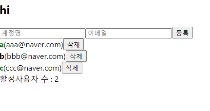

## useMemo

### 성능 최적화를 위해 사용한다.

```js
function countActiveUsers(users) {
  console.log('활성 사용자 수를 세는중...');
  return users.filter(user => user.active).length;
}

//...
const count = countActiveUsers(users);
```


active가 true일 때 count하는 함수를 만들었는데, input 값을 적을 때도 컴포넌트가 리렌더링된다. <br>
명백히 불필요한 호출이다.

이런 상황에 useMemo를 사용하면 성능을 최적화 할 수 있다.

```js
// const count = countActiveUsers(users);
const count = useMemo(() => countActiveUsers(users), [users]);
```

1. 첫 번째 파라미터에는 어떻게 연산할지 정의하는 함수를 넣어준다.
2. 두 번째 파라미터에는 deps 배열을 넣어주는데, 이 배열 안에 넣은 내용이 바뀌면 우리가 등록한 함수를 호출해서 값을 연산하고, 
만약 내용이 바뀌지 않았다면 이전 내용을 재사용한다. 즉, 불러오지 않는다.
